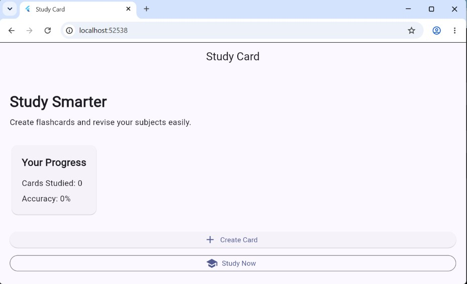
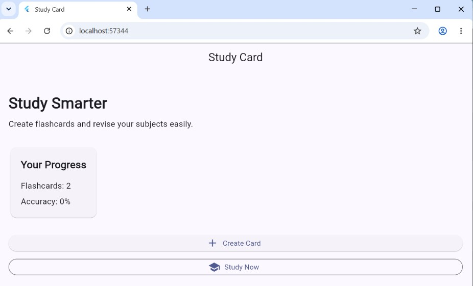

# Study Card App

A Flutter-based study and flashcard application designed to help students
create, manage, and revise study cards.

## Development Progress

### Commit 1 — Initial Flutter Project Setup

**Commit message:** `Initial Flutter project setup`

**Description:**  
Created the Flutter project and initialized the basic project structure
required for developing the Study Card application.

---

### Commit 2 — Create Study Card Home Screen

**Commit message:** `Create study card home screen`

**Description:**  
Designed the initial home screen of the Study Card application. The screen
contains the application title, study introduction, progress section, and
buttons for creating cards and starting a study session.

#### Screenshot

**Screenshot explanation:**  
This screenshot shows the initial Study Card home screen developed in
Commit 2. It displays the study introduction, current progress information,
and the main actions available to the user: Create Card and Study Now.

---

### Commit 3 — Add Flashcard Data Model

**Commit message:** `Add flashcard data model`

**Description:**  
Created a Flashcard data model containing question and answer fields.
Sample flashcards were added to demonstrate how flashcard data is
represented and displayed in the application.

#### Screenshot

**Screenshot explanation:**  
This screenshot shows the Study Card home screen after introducing
the Flashcard data model. The application displays the number of
available flashcards.
