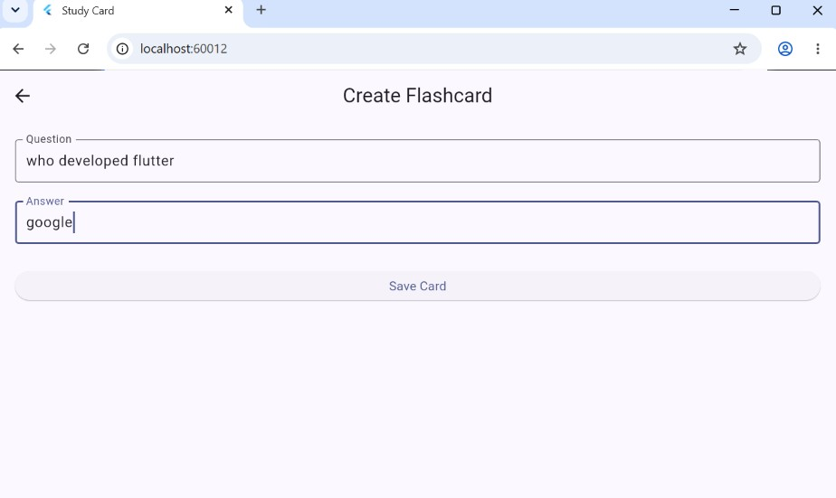

# Study Card App

A Flutter-based study and flashcard application designed to help students
create, manage, and revise study cards.

## Development Progress

### Commit 1 — Initial Flutter Project Setup

**Commit message:** `Initial Flutter project setup`

**Description:**  
Created the Flutter project and initialized the basic project structure
required for developing the Study Card application.

---

### Commit 2 — Create Study Card Home Screen

**Commit message:** `Create study card home screen`

**Description:**  
Designed the initial home screen of the Study Card application. The screen
contains the application title, study introduction, progress section, and
buttons for creating cards and starting a study session.

#### Screenshot

**Screenshot explanation:**  
This screenshot shows the initial Study Card home screen developed in
Commit 2. It displays the study introduction, current progress information,
and the main actions available to the user: Create Card and Study Now.

---

### Commit 3 — Add Flashcard Data Model

**Commit message:** `Add flashcard data model`

**Description:**  
Created a Flashcard data model containing question and answer fields.
Sample flashcards were added to demonstrate how flashcard data is
represented and displayed in the application.

#### Screenshot

**Screenshot explanation:**  
This screenshot shows the Study Card home screen after introducing
the Flashcard data model. The application displays the number of
available flashcards.

---

### Commit 4 — Implement Flashcard Creation

**Commit message:** `Implement flashcard creation`

**Description:**  
Implemented the flashcard creation feature in the Study Card application.
Users can now enter a question and answer and save the flashcard.

A separate Create Flashcard screen was added with input fields for:

- Question
- Answer
- Save Card button

After saving a flashcard, the user is returned to the home screen and
the flashcard count is updated.

#### Screenshot

**Screenshot explanation:**  
This screenshot shows the Create Flashcard screen of the Study Card
application. The user can enter a question and its corresponding answer
and save the new flashcard using the Save Card button.

---

---

### Commit 5 — Implement Flashcard Study Mode

**Commit message:** `Implement flashcard study mode`

**Description:**  
Implemented a Study Mode feature for the Study Card application.

Users can now:

- View the current flashcard question
- Tap the flashcard to reveal the answer
- Move to the next flashcard
- See the current flashcard number

The Study Now button on the home screen opens the Study Mode screen.

#### Screenshot

**Screenshot explanation:**  
This screenshot shows the Study Mode screen of the Study Card application.
The current flashcard question is displayed along with the card number.
The user can tap the card to reveal the answer and use the Next Card button
to continue studying.

---
